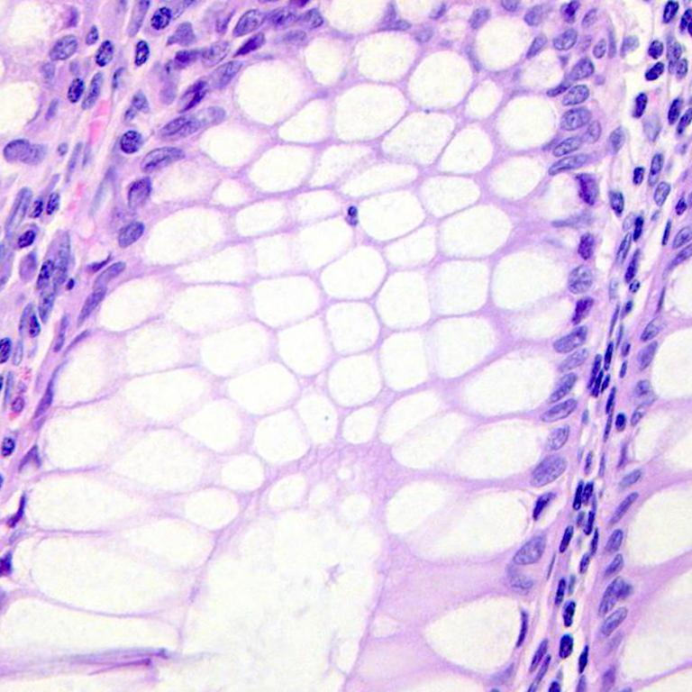
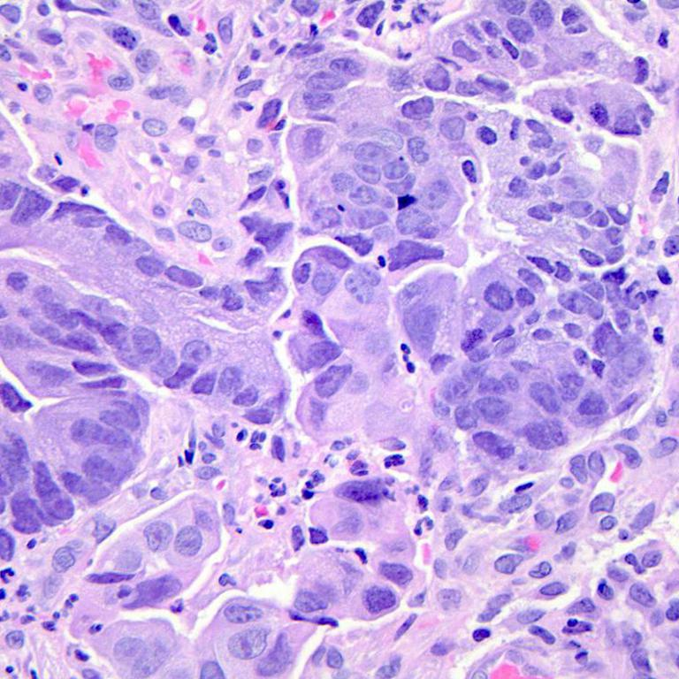

Detecting adenocarcinoma in histopathological images of colon tissue
==============================

The goal is to detect adenocarcinoma through the low presence of fat tissue (white parts) in histopathological images of colon tissue. 
